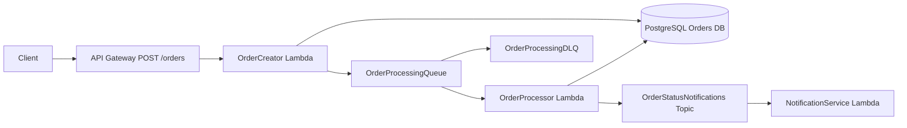

# AWS Serverless E-commerce Backend

A portfolio-grade backend showcasing asynchronous order processing using AWS event-driven patterns with LocalStack for local execution.

## Overview

This project implements a decoupled workflow:

1. API Gateway receives `POST /orders`.
2. `OrderCreator` Lambda validates input, stores a `PENDING` order in PostgreSQL, and pushes an event to SQS.
3. `OrderProcessor` Lambda consumes from SQS, performs idempotent processing, updates order status to `CONFIRMED` or `FAILED`, and publishes to SNS.
4. `NotificationService` Lambda is subscribed to SNS and logs the notification payload.

The API responds quickly with `202 Accepted`, while processing continues asynchronously.

## Architecture



## Project Structure

```text
src/
  shared/
  order_creator_lambda/
  order_processor_lambda/
  notification_service_lambda/
tests/
  unit/
  integration/
infrastructure/
  localstack-init/
sql/
```

## Core Features

- Event-driven serverless pipeline (API Gateway, Lambda, SQS, SNS).
- Dead-letter queue configuration for failed SQS processing.
- Idempotent order processing logic in `OrderProcessor`.
- Structured JSON logging in all Lambda handlers.
- Local development stack with Docker Compose + LocalStack + PostgreSQL.
- Unit and integration tests runnable in containers.

## Prerequisites

- Docker Desktop (or Docker Engine with Compose v2)
- Optional: Python 3.11+ for local test execution outside containers

## Local Setup

1. Copy environment file:

```bash
cp .env.example .env
```

2. Start local services:

```bash
docker compose up -d postgres localstack
```

LocalStack bootstraps the queues, topic, Lambda functions, and API Gateway automatically on startup. The first boot can take around 1-2 minutes because Lambda artifacts are packaged during initialization.

3. Verify resources are created (optional):

```bash
docker compose exec localstack awslocal sqs list-queues
docker compose exec localstack awslocal sns list-topics
docker compose exec localstack awslocal lambda list-functions
```

## Run Tests

Single command for full test suite via Docker Compose:

```bash
docker compose --profile test run --rm tests
```

The test container waits for PostgreSQL and for LocalStack bootstrap completion before running integration checks.

Run only unit tests locally (optional):

```bash
pip install -r requirements.txt
pytest -q tests/unit
```

## API Usage

1. Get API Gateway id:

```bash
docker compose exec localstack awslocal apigateway get-rest-apis
```

2. Submit an order:

```bash
curl -X POST "http://localhost:4566/restapis/<api-id>/prod/_user_request_/orders" \
  -H "Content-Type: application/json" \
  -d '{"user_id":"u-1","product_id":"p-1","quantity":2}'
```

Expected response:

```json
{"order_id":"<uuid>","status":"PENDING"}
```

## Observability

View Lambda logs:

```bash
docker compose exec localstack awslocal logs describe-log-groups
docker compose exec localstack awslocal logs tail /aws/lambda/NotificationService --since 5m
```

## Environment Variables

See `.env.example` for all required values, including:

- Database credentials (`DB_HOST`, `DB_NAME`, `DB_USER`, `DB_PASSWORD`)
- AWS/LocalStack connection (`AWS_REGION`, `AWS_ENDPOINT_URL`)
- Resource names (`ORDER_PROCESSING_QUEUE_NAME`, `ORDER_STATUS_TOPIC_NAME`)

## Deployment Template

A baseline deployment mapping for real AWS is included in:

- `infrastructure/serverless.yml`

It demonstrates the logical wiring between API Gateway, Lambdas, SQS/DLQ, SNS, and a placeholder RDS resource.

## Notes on Consistency and Reliability

- The system is eventually consistent end-to-end.
- Database updates inside each Lambda invocation are transactional.
- Duplicate SQS deliveries are handled idempotently by terminal-state checks.
- Failed processing retries through SQS and can route to DLQ after max receives.
